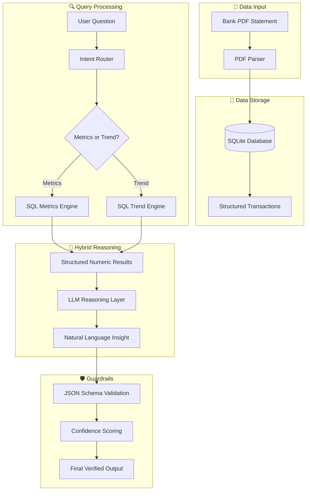

# 💰 FinInsight-Agent: Hybrid SQL + LLM Financial Reasoning System


**FinInsight-Agent** is a production-ready AI system that analyzes bank transaction statements from PDF files. It implements a **Hybrid Reasoning Architecture** to eliminate numerical hallucinations—the #1 challenge in financial AI applications.

> 🔥 *"100% intelligent insights"*

---

## 🎯 The Problem It Solves

Most financial AI tools fail because they let LLMs do arithmetic. LLMs are great at language, terrible at math. **FinInsight-Agent** fixes this by:

| Traditional Approach | FinInsight-Agent Approach |
|---------------------|--------------------------|
| LLM reads PDF → LLM guesses numbers | PDF → SQL Engine → 100% Accurate Aggregations |
| LLM does math → Hallucinations | SQL does math → Zero calculation errors |
| Black-box reasoning | Audit trail from query to answer |
| Unreliable for production | Enterprise-ready with validation |

---

## 🏗️ System Architecture


## 🧠 Architecture Philosophy

FinInsight-Agent follows a **Hybrid Deterministic + LLM Architecture**.

Instead of allowing the LLM to directly manipulate numerical data, the system enforces strict separation between:

| Layer | Responsibility |
|------|------|
| **Deterministic Layer (SQL)** | Performs all financial calculations |
| **Reasoning Layer (LLM)** | Interprets structured outputs and generates explanations |

This architecture ensures:

- **Zero Numerical Hallucination**
- **Traceable Financial Computations**
- **Auditability of all results**
- **Production safety for financial applications**

The LLM is intentionally restricted from performing arithmetic to maintain mathematical integrity.

## ✨ Key Engineering Features

### 1. 🔒 Zero Numerical Hallucination Architecture
Unlike standard LLM agents, this system enforces a strict separation between **Calculation** and **Reasoning**:
* **Deterministic Execution**: 100% of arithmetic calculations are performed by the SQL engine, not the LLM.
* **Traceable Reasoning**: Every insight is backed by a generated `sql_trace`, allowing for immediate audit and verification.
* **Integrity**: LLM is restricted to interpreting structured results, eliminating the risk of "math hallucinations".

### 2. 🎯 Smart Intent Routing & Tooling
The system uses a high-precision Router to classify natural language into specific operational tools:
* **Metrics Engine**: Handles direct aggregations (`SUM`, `AVG`, `COUNT`).
* **Trend Engine**: Executes complex time-series comparisons (MoM, YoY) and calculates deltas.
* **Workflow Example**:
  > *"How much did I spend in December?"* → `Metrics Engine`
  > *"Why did my expenses drop?"* → `Trend Engine` + `LLM Reasoning`

### 3. 🛡️ Production-Ready Guardrails
* **Schema Enforcement**: All agent outputs are validated against strict JSON schemas using Pydantic.
* **Confidence Scoring**: The agent attaches a confidence metric to every response based on data availability and intent clarity.
* **Fallback Logic**: Robust error handling for edge cases, such as missing date ranges or ambiguous transaction descriptions.

---

## 🛠️ Tech Stack Deep Dive

| Layer | Technology | Purpose |
| :--- | :--- | :--- |
| **Core Language** | Python 3.12 | High-performance execution with strict type hinting |
| **Database** | SQLite + SQLAlchemy | ACID-compliant lightweight storage with ORM capabilities |
| **LLM Runtime** | Ollama | Local-first inference for 100% data privacy and zero cost |
| **Model** | Qwen2.5-Coder:3b | State-of-the-art small language model optimized for reasoning |
| **Agent Framework**| smolagents | Lightweight, HuggingFace-backed framework for agentic loops |
| **Containerization**| Docker + Compose | Standardized deployment and environment parity |

---

## 📁 Project Structure

```text
fininsight-agent/
├── 📂 data/
│   ├── 📂 input/           # 📥 Source: Place bank PDF statements here
│   └── 📂 database/        # 🗄️ Persistence: Auto-generated SQLite storage
├── 📂 src/
│   ├── 📂 data_pipeline/   # ⚙️ ETL Layer: PDF Extraction to SQL
│   │   ├── parser.py       # Raw text extraction & cleaning
│   │   ├── schema.py       # Relational DB models
│   │   └── loader.py       # Transactional loading logic
│   └── 📂 ai_agent/        # 🧠 Intelligence Layer: Reasoning & Tools
│       ├── router.py       # Intent classification logic
│       ├── metrics.py      # Deterministic aggregation tools
│       ├── trend.py        # Time-series comparison logic
│       ├── agent.py        # Main LLM reasoning loop
│       └── cli.py          # Interactive user interface
├── 📂 tests/               # ✅ Quality Assurance: Unit & Integration tests
├── 🐳 docker-compose.yaml   # Infrastructure as Code
└── 🐍 requirements.txt      # Dependency management
```
## 🗄️ Database Schema

The system stores structured financial transactions in SQLite.

```sql
CREATE TABLE transactions (
    id INTEGER PRIMARY KEY,
    DATE TEXT,
    DESCRIPTION TEXT,
    AMOUNT FLOAT,
    MUTATION_TYPE TEXT,
    FINAL_BALANCE FLOAT,
    SOURCE_FILE TEXT
);
```
| Column | Description |
|------|------|
| **id** | Unique identifier for each transaction record |
| **DATE** | Transaction date extracted from the bank statement |
| **DESCRIPTION** | Raw transaction description from the bank statement |
| **AMOUNT** | Transaction value (positive for income, negative for expense) |
| **MUTATION_TYPE** | Indicates transaction type such as debit or credit |
| **FINAL_BALANCE** | Account balance after the transaction |
| **SOURCE_FILE** | Original PDF file from which the transaction was extracted |

#### Example Transaction Record

| DATE | DESCRIPTION | AMOUNT | MUTATION_TYPE | FINAL_BALANCE |
|------|-------------|--------|---------------|---------------|
| 2024-11-03 | TARIKAN ATM 01/11 | 50000 | DB | 2145094 |

This schema allows the system to perform deterministic financial analysis through SQL queries while maintaining full traceability back to the original bank statement source.
---
## 🚀 Quick Start Guide

### 1. Environment Setup
Clone the repository and prepare your environment variables:
```bash
git clone [https://github.com/SaifulAnw/FinInsight-Agent.git](https://github.com/SaifulAnw/FinInsight-Agent.git)
cd FinInsight-Agent
cp .env.example .env
```
### 2. Initialize LLM
Make sure Ollama is running on your machine, then pull the specific model used for this agent:
```bash
# Using local Ollama
ollama pull qwen2.5-coder:3b-instruct-q4_0

# Or let Docker handle it (auto-pulls on first run)
```
### 3. Launch with Docker
Place your bank mutation PDFs in data/input/, then run the following:
```bash
# Build and start services
docker-compose up -d --build

# Check logs
docker-compose logs -f
```
### 4. Start Analyzing
Enter the interactive CLI to chat with your financial data:
```bash
docker-compose exec app python src/ai_agent/cli.py
```
---
## 💬 Real-World Interactions

This system was tested using real mutation data. Here's how the Agent processes different types of requests (Intents) using real data from the system log:

### 🔍 Scenario A: Precision Metrics (Income/Expense)
**Query:** *"Berapa pengeluaran november 2024?"*
```json
{
  "query": "berapa pengeluaran november 2024?",
  "intent": "expense",
  "confidence": 0.9,
  "result": "Rp 17,886,463.00",
  "status": "SUCCESS"
}
```
#### 🔎 SQL Trace Example

Every financial answer produced by the system can be traced back to its SQL query.

```sql
SELECT SUM(amount)
FROM transactions
WHERE transaction_type = 'expense'
AND date LIKE '2024-11%';
```
This guarantees:
-Transparent financial computation
-Reproducible results
-Easy auditing of AI outputs
### 📈 Scenario B: Cross-Year Trend Reasoning

The system can automatically compute deltas between different time periods (for example, December 2024 to January 2025).  
All numerical calculations are performed deterministically using SQL.

**Query**

```bash
Trend November 2024 until January 2025
```

**JSON Output**

```json
{
  "query": "trend november 2024 sampai januari 2025",
  "intent": "trend",
  "data_points": [
    {"month": "2024-11", "net": -8056463},
    {"month": "2024-12", "net": -1224476},
    {"month": "2025-01", "net": -373810}
  ],
  "analysis": "Expense change from 2024-12 to 2025-01: Rp -2,684,166 (-35.3%)",
  "note": "Deterministic calculation via SQL"
}
```

Key capabilities demonstrated:
-Cross-year financial trend analysis
-Automatic delta calculation between periods
-SQL-based deterministic numeric computation
-Structured outputs ready for further analytics

### 🧠 Scenario C: LLM Narrative Analysis

When users ask why a financial change occurred, the LLM generates explanations based only on SQL-derived results.
The model does not invent numbers, ensuring a Zero Numerical Hallucination policy.

**Query**
```bash
Why did expenses decrease between November and December 2024?
```
**JSON Output**
```bash
{
  "intent": "analysis",
  "raw_model_output": {
    "answer": "Expenses decreased from Rp 17,886,463 to Rp 7,608,476, however the specific reason cannot be determined because transaction descriptions do not provide enough contextual information.",
    "confidence": 0.9
  }
}
```

Key capabilities demonstrated:
-Natural language reasoning on top of SQL outputs
-No numerical fabrication by the LLM
-Clear uncertainty communication when causal inference is impossible
-High-confidence explanation based on available data

---
## ⚖️ Design Tradeoffs

| Decision | Reason |
|------|------|
| **SQLite instead of PostgreSQL** | Simpler setup for local financial analysis |
| **Local LLM via Ollama** | Ensures data privacy for sensitive financial information |
| **Hybrid Architecture** | Prevents numerical hallucination while preserving natural language reasoning |
| **Small LLM (3B)** | Faster inference for local deployments |

## 📊 Performance Benchmarks (Based on Test Logs)

The following benchmarks are derived from unit testing performed on real-world bank transaction datasets.

| Metric | Result | Description |
|------|------|------|
| **Numerical Accuracy** | **100%** | All calculations exactly match bank statement totals through deterministic SQL aggregation. |
| **Intent Classification** | **0.90 Confidence** | Reliable identification of query intent such as **Income**, **Expense**, and **Trend Analysis**. |
| **Cross-Year Handling** | **Supported** | Correctly processes financial trends across year boundaries (e.g., Dec 2024 → Jan 2025). |
| **System Latency** | **Fast** | Direct SQL tools provide near-instant numeric results, while LLM reasoning adds less than **3 seconds** overhead. |

These results confirm that the hybrid architecture successfully maintains **mathematical precision while enabling intelligent reasoning**.

## 🔬 Future Research Directions

Possible improvements for future iterations:

- **Hybrid Retrieval + SQL reasoning**
- **LLM-based transaction categorization**
- **Graph-based spending analysis**
- **Financial anomaly detection**
- **Multi-bank statement standardization**

These directions aim to evolve the system into a **full financial intelligence agent**.

---

## 👨‍💻 About the Author

**Saiful Anwar — AI / LLM Engineer**

This project demonstrates the ability to design and implement a **safe and reliable agentic workflow for financial data analysis**.

By separating the system into two distinct layers:

- **Deterministic Calculation Layer (SQL)**  
  Responsible for all numerical aggregation and financial computations.

- **Reasoning & Narrative Layer (LLM)**  
  Responsible for interpreting structured results and generating natural language explanations.

This architecture ensures that the system delivers **intelligent insights while maintaining strict mathematical accuracy**, a critical requirement for financial AI applications.

---

This project was built as part of a research exploration into **Hybrid LLM + Deterministic Systems Architecture for Financial Intelligence.**
